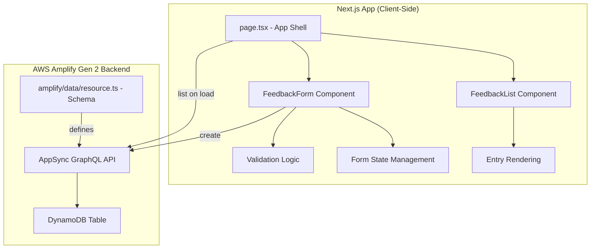

# Design Document: Workshop Feedback App

## Overview

The Workshop Feedback App is a single-page Next.js application that allows workshop attendees to submit and view feedback. The app uses a progressive architecture: initially storing feedback in React state, then integrating AWS Amplify Gen 2 Data for cloud persistence backed by DynamoDB via AppSync.

The design prioritizes simplicity (beginner-friendly 90-minute workshop context), accessibility (programmatic label associations), and a responsive single-column layout styled with Tailwind CSS.

## Architecture



### Key Architecture Decisions

1. **Client-side rendering with `"use client"`**: The feedback form requires interactivity (state, event handlers, effects). The page will be a client component.

2. **Single-page design**: All functionality (form + list) lives on the index page (`app/page.tsx`). No routing needed.

3. **Progressive backend integration**: Phase 1 uses local React state. Phase 2 adds Amplify Data with a typed client. The component structure remains the same — only the data layer changes.

4. **Amplify Gen 2 Data with public API key auth**: For a workshop demo, `allow.publicApiKey()` authorization is appropriate. No user authentication is required.

5. **Validation in a pure utility function**: Form validation logic is extracted into a pure function (`validateFeedback`) to enable property-based testing without DOM dependencies.

## Components and Interfaces

### Component Hierarchy

```
app/page.tsx (FeedbackPage)
├── FeedbackForm
│   ├── Name input (text, maxLength 100)
│   ├── RatingSelector (select, values 1-5)
│   ├── Comment textarea (maxLength 500)
│   └── Submit button
└── FeedbackList
    └── FeedbackEntry (repeated)
```

### Component Interfaces

```typescript
// app/page.tsx - Main page component (client component)
// Manages feedback state, handles create/load, renders Form + List

// components/FeedbackForm.tsx
interface FeedbackFormProps {
  onSubmit: (data: FeedbackInput) => Promise<void>;
  isSubmitting: boolean;
  submitError: string | null;
}

// components/FeedbackList.tsx
interface FeedbackListProps {
  entries: FeedbackEntry[];
  isLoading: boolean;
  loadError: string | null;
}

// components/RatingSelector.tsx
interface RatingSelectorProps {
  value: number | null;
  onChange: (rating: number | null) => void;
  error?: string;
  id: string;
}
```

### Utility Interfaces

```typescript
// lib/validation.ts
interface ValidationErrors {
  name?: string;
  rating?: string;
  comment?: string;
}

function validateFeedback(input: FeedbackInput): ValidationErrors;
// Returns empty object if valid, otherwise field-specific error messages.
```

## Data Models

### FeedbackEntry

```typescript
// types/feedback.ts
interface FeedbackInput {
  name: string;
  rating: number | null;
  comment: string;
}

interface FeedbackEntry {
  id: string;
  name: string;
  rating: number;       // integer 1-5
  comment: string;
  createdAt: string;    // ISO 8601 timestamp
}
```

### Amplify Data Schema

```typescript
// amplify/data/resource.ts
import { a, defineData, type ClientSchema } from '@aws-amplify/backend';

const schema = a.schema({
  Feedback: a.model({
    name: a.string().required(),
    rating: a.integer().required(),
    comment: a.string().required(),
  })
  .authorization(allow => [allow.publicApiKey()])
});

export type Schema = ClientSchema<typeof schema>;

export const data = defineData({
  schema,
  authorizationModes: {
    defaultAuthorizationMode: 'apiKey',
    apiKeyAuthorizationMode: { expiresInDays: 30 }
  }
});
```

The Amplify model automatically provides `id`, `createdAt`, and `updatedAt` fields along with CRUD operations and real-time subscriptions.

## Correctness Properties

*A property is a characteristic or behavior that should hold true across all valid executions of a system — essentially, a formal statement about what the system should do. Properties serve as the bridge between human-readable specifications and machine-verifiable correctness guarantees.*

### Property 1: Whitespace-only text fields are rejected

*For any* string composed entirely of whitespace characters (spaces, tabs, newlines, or combinations thereof), when used as either the name or comment field in a feedback submission, the validation function SHALL return an error for that field and the submission SHALL be prevented.

**Validates: Requirements 2.1, 2.3**

### Property 2: Overlength text fields are rejected

*For any* string with length greater than 100 characters used as a name, or any string with length greater than 500 characters used as a comment, the validation function SHALL return an error for that field and the submission SHALL be prevented.

**Validates: Requirements 2.4**

### Property 3: All invalid fields produce simultaneous errors

*For any* combination of invalid field values (whitespace-only name, no rating, whitespace-only comment, overlength fields), the validation function SHALL return error messages for every invalid field in a single pass, not just the first one encountered.

**Validates: Requirements 2.5**

### Property 4: Valid feedback creates a matching entry

*For any* valid feedback input (name: 1-100 non-whitespace-only characters, rating: integer 1-5, comment: 1-500 non-whitespace-only characters), creating a feedback entry SHALL produce an entry whose name, rating, and comment match the original input exactly.

**Validates: Requirements 3.1**

### Property 5: Feedback list maintains reverse-chronological order

*For any* sequence of feedback entries with distinct creation timestamps, the feedback list SHALL always display them ordered from most recent to oldest (descending by createdAt).

**Validates: Requirements 3.3, 4.1**

### Property 6: Rendered entries contain all required fields

*For any* feedback entry with a name, rating (1-5), and comment, the rendered representation SHALL include the entry's name, its numeric rating value, and its comment text.

**Validates: Requirements 4.2**

## Error Handling

| Scenario | Behavior |
|----------|----------|
| Validation failure on submit | Display per-field error messages adjacent to invalid fields. Do not submit. |
| Amplify Data save failure | Display a toast/banner error message ("Feedback could not be saved. Please try again."). Preserve form data so user can retry. Re-enable submit button. |
| Amplify Data load failure | Display an error message in the list area ("Could not load feedback. Please refresh the page."). |
| Network timeout | Treat as save/load failure depending on the operation. |

Error messages are displayed inline. The app does not crash or navigate away on errors.

## Testing Strategy

### Unit Tests (Example-Based)

- Form renders with correct structure (name input, rating selector, comment textarea, submit button)
- Labels are programmatically associated with inputs (accessibility)
- Rating selector shows options 1-5 with no default
- Submit button is disabled during submission
- Form clears after successful submission
- Empty list shows "no feedback" message
- New entry appears without page reload
- Error messages display on Amplify save/load failure
- Form data preserved on save failure
- Layout uses max-w-2xl, centered, with padding

### Property-Based Tests

**Library**: [fast-check](https://github.com/dubzzz/fast-check) (TypeScript PBT library)

**Configuration**: Minimum 100 iterations per property test.

Each property test maps to a correctness property above:

1. **Feature: workshop-feedback-app, Property 1: Whitespace-only text fields are rejected**
   - Generator: arbitrary whitespace strings (spaces, tabs, \n, \r, combinations)
   - Assertion: `validateFeedback({ name: ws, rating: 3, comment: "valid" })` returns name error; similarly for comment field

2. **Feature: workshop-feedback-app, Property 2: Overlength text fields are rejected**
   - Generator: strings with length in range [101, 1000] for name; [501, 2000] for comment
   - Assertion: `validateFeedback(...)` returns appropriate length error

3. **Feature: workshop-feedback-app, Property 3: All invalid fields produce simultaneous errors**
   - Generator: random combinations of invalid states per field (whitespace name, null rating, whitespace comment, overlength)
   - Assertion: number of errors returned equals number of invalid fields

4. **Feature: workshop-feedback-app, Property 4: Valid feedback creates a matching entry**
   - Generator: valid names (1-100 chars, not all whitespace), valid ratings (1-5), valid comments (1-500 chars, not all whitespace)
   - Assertion: created entry's fields match input exactly

5. **Feature: workshop-feedback-app, Property 5: Feedback list maintains reverse-chronological order**
   - Generator: arrays of entries with random timestamps
   - Assertion: after sorting, each entry's createdAt >= next entry's createdAt

6. **Feature: workshop-feedback-app, Property 6: Rendered entries contain all required fields**
   - Generator: random valid FeedbackEntry objects
   - Assertion: rendered output contains the entry's name, rating number, and comment text

### Integration Tests

- Amplify Data `create` is called with correct fields on submit
- Amplify Data `list` is called on page load and results are rendered
- Real-time updates via `observeQuery` (manual/E2E test during workshop)
